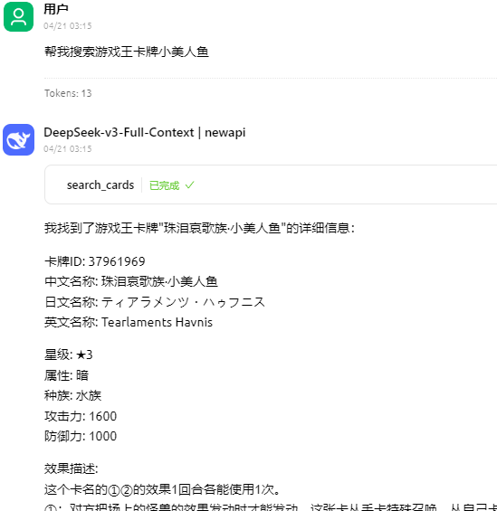

# 百鸽(ygocdb.com) MCP Server

[English](README/README.en.md) | 中文

一个基于 [Model Context Protocol (MCP)](https://modelcontextprotocol.io/) 的服务端，用于与 [百鸽(ygocdb.com)](https://ygocdb.com/) API 交互。提供了一系列工具来查询游戏王中文卡牌信息。

[](https://smithery.ai/server/@lieyanqzu/ygocdb-mcp)

<a href="https://glama.ai/mcp/servers/@lieyanqzu/ygocdb-mcp">
  
</a>

## API 文档

本服务端基于游戏王卡牌数据库的公开 API。

- 卡牌搜索: `https://ygocdb.com/api/v0/?search=关键字`
- 卡牌图片: `https://cdn.233.momobako.com/ygopro/pics/<id>.jpg`

## 使用示例



## 功能特性

- **search_cards**  
  通过关键字搜索游戏王卡牌，可以搜索卡牌名称、效果文本等。
  
- **get_card_by_id**  
  通过卡牌ID获取单张游戏王卡牌的详细信息。
  
- **get_card_image**  
  通过卡牌ID获取游戏王卡牌的图片。

## 使用方法

### 通过 NPM 包使用

```bash
# 全局安装
npm install -g ygocdb-mcp-server

# 或直接运行（推荐）
npx ygocdb-mcp-server
```

### 本地开发

```bash
# 克隆项目
git clone <repository-url>
cd ygocdb-mcp

# 安装依赖
npm install

# 构建项目
npm run build

# 运行 STDIO 模式
npm run start:stdio

# 运行 HTTP 模式
npm run start:http
```

### 运行模式

服务端支持两种运行模式：

#### STDIO 模式（默认）
用于与 Claude Desktop 等 MCP 客户端直接集成：

```bash
npm run start:stdio
```

#### HTTP 模式
用于容器部署或 HTTP 客户端访问：

```bash
npm run start:http
```

HTTP 服务器将在端口 8081 上启动，端点为 `http://localhost:8081/mcp`

### 在 Claude Desktop 中集成

在 `claude_desktop_config.json` 中添加配置：

#### 使用 NPX（推荐）
```json
{
  "mcpServers": {
    "ygocdb": {
      "command": "npx",
      "args": ["ygocdb-mcp-server"]
    }
  }
}
```

#### 使用本地构建
```json
{
  "mcpServers": {
    "ygocdb": {
      "command": "node",
      "args": ["path/to/ygocdb-mcp/dist/index.js"],
      "cwd": "path/to/ygocdb-mcp"
    }
  }
}
```

### Docker 部署

```bash
# 构建镜像
docker build -t ygocdb-mcp .

# 运行 STDIO 模式（用于集成）
docker run -i --rm ygocdb-mcp

# 运行 HTTP 模式（用于服务）
docker run -p 8081:8081 ygocdb-mcp
```

### 跨平台支持

项目使用 `cross-env` 确保在所有平台上正确设置环境变量：

- **Windows**: `npm run start:http` 或 `npm run start:stdio`
- **macOS/Linux**: `npm run start:http` 或 `npm run start:stdio`
- **Docker**: 自动使用 HTTP 模式
